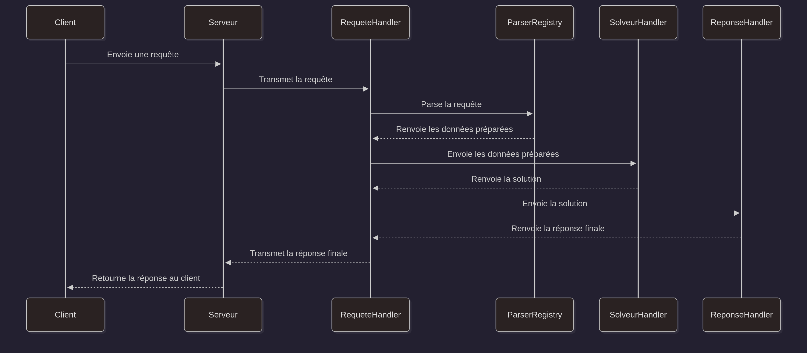

[← Retour au README](../../README.md)

# Documentation de la partie C++

---

## 1. Introduction

Ce document présente l’architecture générale du serveur C++ développé pour traiter des requêtes JSON,
construire des données algorithmiques (ex. graphe, distances), exécuter un algorithme de résolution
(comme le TSP) et renvoyer une réponse JSON structurée au client.

Le projet est conçu pour être **modulaire**, **extensible** et **séparé en couches** afin de faciliter
l’évolution du code ainsi que l’ajout de nouveaux algorithmes, parseurs ou types d’entités.

L’ensemble du serveur repose sur trois grands piliers :

- **Le modèle**, qui fournit les structures de données fondamentales (graphe, sommets, arêtes, géographie…).  
- **Les algorithmes**, qui transforment le modèle en solution exploitable (TSP, distances…).  
- **La couche serveur**, qui analyse les requêtes, orchestre les traitements et génère les réponses.

Ce document décrit chacune de ces parties et détaille le cycle complet d’une requête.

---

### Table des matières

1. [Introduction](#1-introduction)  
2. [Architecture générale](#2-architecture-générale)  
   - [2.1. Modèle](#21-modèle-représentation-des-données)  
   - [2.2. Algorithmes](#22-algorithmes-construction-des-données-et-résolution)  
   - [2.3. Serveur](#23-serveur-analyse-des-requêtes-et-génération-des-réponses)  
3. [Cycle d'une requête](#3-cycle-dune-requête)  
   - [3.1. Réception de la requête](#31-réception-de-la-requête)  
   - [3.2. Traitement par le RequeteHandler](#32-traitement-par-le-requetehandler)  
   - [3.3. Exécution de l’algorithme](#33-exécution-de-lalgorithme)  
   - [3.4. Renvoi de la réponse](#34-renvoie-de-la-réponse)  
   - [3.5. Diagramme de séquence](#35-diagramme-de-séquence)  
4. [Fonctionnement des gestionnaires (Handlers)](#4-fonctionnement-des-gestionnaires-handlers)  
5. [Le système de parseurs et le ParserRegistry](#5-le-système-de-parseurs-et-le-parserregistry)  
6. [Le modèle : représentation générique des graphes](#6-le-modèle--représentation-générique-des-graphes)  
   - [6.1. Composants principaux](#61-composants-principaux-du-modèle)  
   - [6.2. Fonctionnalités](#62-fonctionnalités-offertes-par-graphest)  
   - [6.3. Intégration algorithmique](#63-intégration-avec-la-couche-algorithme)


## 2. Architecture générale

Le projet est organisé en trois grandes parties : le **modèle**, les **algorithmes** et le **serveur**.  
Chacune regroupe des composants spécifiques jouant un rôle dans le traitement d’une requête.

---

### 2.1. Modèle (représentation des données)

Contient les structures fondamentales manipulées par les algorithmes :

- **Graphe** : `graphe.h`, `sommet.h`, `arete.h`, `g_element.h`, `p_element.h`, `a_element.h`
- **Cartographie générique** : `carte.h`, `distance.h`
- **Géographie** : `coord_geographique.h`, `distance_geodesique.h`, `ville.h`

Ces classes décrivent les entités, les distances et les structures nécessaires pour construire un graphe.

---

### 2.2. Algorithmes (construction des données et résolution)

Contient les outils permettant d’exécuter des algorithmes sur le modèle :

- **Construction des données** : `i_data_builder.h`, `algo_distance_data_builder.h`
- **Données algorithmiques** : `algo_distance_data.h`, `algo_distance_solution.h`
- **Solveurs** :
  - Interface solveur : `i_solveur_handler.h`
  - Solveur TSP : `tsp_solveur_handler.h`
  - Factory des solveurs : `solveur_handler_factory.h`

Cette partie prépare les données à partir du modèle et exécute l’algorithme demandé (ex. TSP).

---

### 2.3. Serveur (analyse des requêtes et génération des réponses)

Contient la logique applicative du serveur :

- **Requête** :
  - Gestionnaires : `algo_distance_requete_handler.h`, `i_requete_handler.h`, `requete_handler_factory.h`
  - Parseurs :
    - Entités : `i_entite_parser_base.h`, `i_entite_parser.h`, `ville_parser.h`
    - Distances : `i_distance_parser_base.h`, `i_distance_parser.h`, `distance_geodesique_parser.h`
    - Enregistrement des parseurs : `parser_registry.h`

- **Réponse** :
  - Gestionnaires : `i_reponse_handler.h`, `algo_distance_reponse_handler.h`, `reponse_handler_factory.h`
  - Types de réponse : `algo_distance_reponse.h`

- **Serveur TCP** : `serveur_tcp.h`

Le serveur reçoit la requête, sélectionne le bon gestionnaire, prépare les données via les parseurs, exécute l’algorithme, puis génère une réponse JSON.

---

## 3. Cycle d'une requête

Cette section décrit le déroulement complet d'une requête côté serveur.

---

### 3.1. Réception de la requête

Le serveur reçoit une requête JSON depuis le client.
Le seul champ **obligatoire** est :

- `commande` : détermine le type de traitement à effectuer et permet de sélectionner le `RequeteHandler` approprié.

#### Exemple de requête minimale

```json
{
    "commande": "algo_distance"
}
```

#### Structure complète d'une requête pour exécuter un algorithme TSP

Une requête permettant d'exécuter un algorithme de distance (ex : TSP) peut contenir **un ou plusieurs ensembles** :


```json
{
    "commande": "algo_distance",
    "algo": "tsp",
    "entite": "ville",
    "distance": "geodesique",

    "ensembles": [
        {
            "machines": 1,
            "donnees": [
                { "nom": "Strasbourg", "latitude": 48.58, "longitude": 7.75 },
                { "nom": "Metz", "latitude": 49.12, "longitude": 6.17 },
                { "nom": "Nancy", "latitude": 48.69, "longitude": 6.18 }
            ]
        },
        {
            "machines": 3,
            "donnees": [
                { "nom": "Paris", "latitude": 48.85, "longitude": 2.35 },
                { "nom": "Lyon", "latitude": 45.75, "longitude": 4.85 },
                { "nom": "Dijon", "latitude": 47.32, "longitude": 5.04 }
            ]
        }
    ]
}
```

---

### 3.2. Traitement par le RequeteHandler

Le `RequeteHandler` responsable de la commande effectue les actions suivantes :

1. Extraction des champs JSON obligatoires (`algo`, `entite`, `distance`, `ensembles`).
2. Sélection du parseur d'entité et du parseur de distance via *ParserRegistry*.
3. Sélection du solveur via *SolutionHandler*.
4. Pour chaque ensemble du tableau `ensembles` :
    - extraction de `machines` et `donnees`.
    - construction des données algorithmiques via le parseur d’entité.
    - exécution du solveur correspondant (`algo`).
    - génération d’une réponse simple via un *ReponseHandler*.
5. Toutes les réponses simples sont ensuite :
   - soit renvoyées telles quelles si une seule existe
   - soit regroupées dans une réponse composée automatiquement gérée par `IReponse`
6. Le *RequeteHandler* retourne la réponse finale au serveur.

---

### 3.3. Exécution de l'algorithme

Le *SolveurHandler* sélectionne l'algorithme à utiliser (via le champ JSON `algo`, dans notre projet = TSP).
Il calcule la solution en utilisant les données préparées.

---

### 3.4. Renvoie de la réponse

Le serveur renvoie toujours un JSON contenant un tableau nommé `"reponse"`.

Ce tableau contient :

- une seule entrée si la requête contient un seul ensemble
- plusieurs entrées si plusieurs ensembles ont été fournis

#### Structure de la réponse JSON (type TSP)

Lorsqu'un algorithme de distance (type TSP) est exécuté sur les données fournies d ans la requête, le serveur renvoie
une réponse JSON contenant :

- `chemin` : l'ordre optimal des entités visitées.
- `distances` : les distances entre chaque étape du chemin.
- `distanceTotale` : la distance totale du parcours optimisé.

Voici un exemple de réponse renvoyée par le serveur :

```json
{
    "reponse": [
        {
            "chemin": ["Strasbourg", "Nancy", "Metz"],
            "distances": ["116", "130"],
            "distanceTotale": "246"
        },
        {
            "chemin": ["Paris", "Lyon", "Dijon"],
            "distances": ["392", "195"],
            "distanceTotale": "588"
        }
    ]
}
```

---

### 3.5. Diagramme de séquence



---

## 4. Fonctionnement des gestionnaires (Handlers)

Le projet utilise de nombreux gestionnaires (appelés *handlers*) répartis dans différentes parties du code :  
gestion des requêtes, des réponses, des algorithmes, etc.  
Bien que leurs rôles diffèrent, ils suivent tous une **même philosophie de conception**.

---

### 4.1. Une interface commune pour chaque famille

Chaque type de handler possède une interface abstraite définissant son comportement :

- `i_requete_handler.h`
- `i_solveur_handler.h`
- `i_reponse_handler.h`

Ces interfaces imposent :
- une méthode indiquant si le handler peut traiter la demande,
- une méthode pour produire le résultat,
- une gestion interne du “handler suivant” dans la chaîne.

---

### 4.2. Pattern utilisé : Chaîne de responsabilité

Les trois familles utilisent le **pattern Chain of Responsibility** :

1. Un handler reçoit une requête interne (commande, algorithme, données, solution…).
2. S’il peut la traiter → il le fait.  
3. Sinon → il la transmet au **prochain handler de la chaîne**.

Cette organisation permet :
- d’ajouter facilement de nouveaux handlers,
- de séparer clairement les rôles,
- d’éviter les blocs `if` ou `switch` géants.

---

### 4.3. Pattern utilisé : Factory pour leur création

Chaque famille est construite via une **factory dédiée** :

- `requete_handler_factory.h`
- `solveur_handler_factory.h`
- `reponse_handler_factory.h`

Ces factories servent à :
- instancier les handlers,
- composer automatiquement la chaîne de responsabilité,
- enregistrer dynamiquement de nouveaux handlers,
- retourner la **tête de chaîne** utilisée par le serveur.

---

## 5. Le système de parseurs et le ParserRegistry

Le serveur utilise un système de parseurs modulaires pour interpréter les données JSON reçues dans une requête.
Ces parseurs sont organisés autour d’un composant central : le **ParserRegistry**, un registre générique permettant
d’enregistrer et de retrouver dynamiquement les parseurs disponibles.

---

### 5.1. Interfaces de base des parseurs

Tous les parseurs du système partagent une interface déclarative commune :

- `i_parser_base.h`  
  → Fournit un nom textuel pour identifier le parseur (`nom()`)  
  → Fournit le nom du type cible (`typeCible()`)

Ensuite, chaque catégorie de parseur possède son interface spécialisée :

- **Parseurs d’entités** :  
  - `i_entite_parser_base.h`  
  - `i_entite_parser.h`

- **Parseurs de distances** :  
  - `i_distance_parser_base.h`  
  - `i_distance_parser.h`

Chaque parseur concret (ex : `VilleParser`, `DistanceGeodesiqueParser`) hérite **de son interface spécialisée**,
et indirectement de `IParserBase<T>` pour la partie déclarative.

---


### 5.2. Le rôle du ParserRegistry

`parser_registry.h` définit une structure générique permettant :

- d’enregistrer un parseur sous un nom (ex : `"ville"`, `"geodesique"`),
- de récupérer dynamiquement ce parseur pendant le traitement de la requête.

Il existe un registre **par type de parseur**, par exemple :

```cpp
ParserRegistry<IEntiteParserBase>
ParserRegistry<IDistanceParserBase>
```

Chaque registre est un singleton interne contenant une map :

```cpp
nom → parseur
```

---

### 5.3 Cycle d'utilisation

#### Enregistrement d'un parseur

```cpp
ParserRegistry<IEntiteParserBase>::enregistrerParser("ville", std::make_shared<VilleParser>());
```

#### Récupération d'un parseur

```cpp
auto entiteParser = ParserRegistry<IEntiteParserBase>::get("ville");
```

---

## 6. Le modèle : représentation générique des graphes

Le modèle du projet repose sur une structure générique permettant de représenter n’importe quel graphe composé de sommets et d’arêtes typées.  
Il constitue la base de toutes les opérations algorithmiques (distance, TSP, etc.).

---

### 6.1. Composants principaux du modèle

Le modèle est organisé en plusieurs classes situées dans `modele/graphe/` :

- **`sommet.h`**  
  Représente un sommet du graphe. Chaque sommet est identifié par une clé unique et contient une valeur typée `T`.

- **`arete.h`**  
  Représente une arête reliant deux sommets. L’arête porte une valeur typée `S` (ex : une distance).

- **`p_element.h`**  
  Implémente une liste chaînée générique utilisée pour stocker les sommets et les arêtes.  
  Ce choix permet une structure simple et légère, adaptée aux manipulations algorithmiques.

- **`g_element.h`, `a_element.h`**  
  Éléments utilitaires pour décrire des entités du graphe.

- **`graphe.h`**  
  Classe centrale du modèle. Elle encapsule :
  - une liste chaînée de sommets,
  - une liste chaînée d’arêtes,
  - la création, la copie et la destruction des éléments du graphe,
  - les fonctions de parcours : voisins, arêtes adjacentes, adjacences,
  - une conversion vers chaîne pour debug.

La classe `Graphe<S, T>` est entièrement générique :  
`S` = type porté par les arêtes,  
`T` = type porté par les sommets.

---

### 6.2. Fonctionnalités offertes par `Graphe<S, T>`

La classe fournit un ensemble d’opérations essentielles :

- création de sommets (`creeSommet`)
- création d’arêtes (`creeArete`)
- extraction des voisins d’un sommet
- récupération d’une arête reliant deux sommets
- construction d’un graphe par copie (copie profonde)
- destruction complète et sécurisée de tous les éléments

Cette structure a été pensée pour être :

- **simple** (listes chaînées, pointeurs explicites),
- **efficace** (pas de surcharge inutile),
- **adaptée aux algorithmes de graphes** (TSP, distances, etc.),
- **générique** (les types de sommets et d’arêtes sont paramétrables).

---

### 6.3. Intégration avec la couche algorithme

Les algorithmes du projet (situés dans `algorithmes/`) ne manipulent jamais directement les objets JSON.  
Ils reçoivent **un graphe déjà construit**, typé selon les entités manipulées.

Ce graphe est créé automatiquement par :

- le parseur d’entité (`IEntiteParser<T>`)
- la stratégie de distance (`Distance<T>`)
- la classe `Carte<T, R>` (dans `modele/generique/`),  
  qui assemble les entités, calcule les distances et génère un `Graphe<S, T>` complet.

Ainsi, le modèle sert de **pont entre la couche serveur et la couche algorithmique**.

---